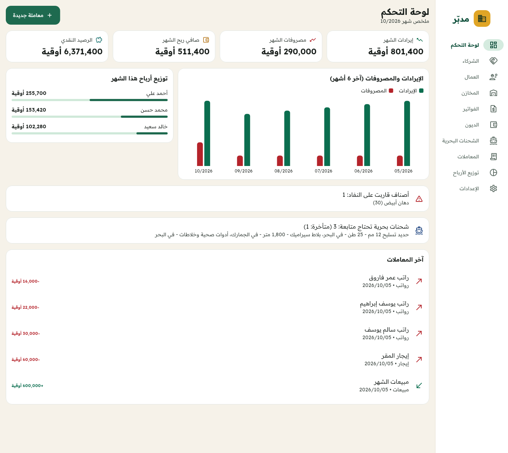
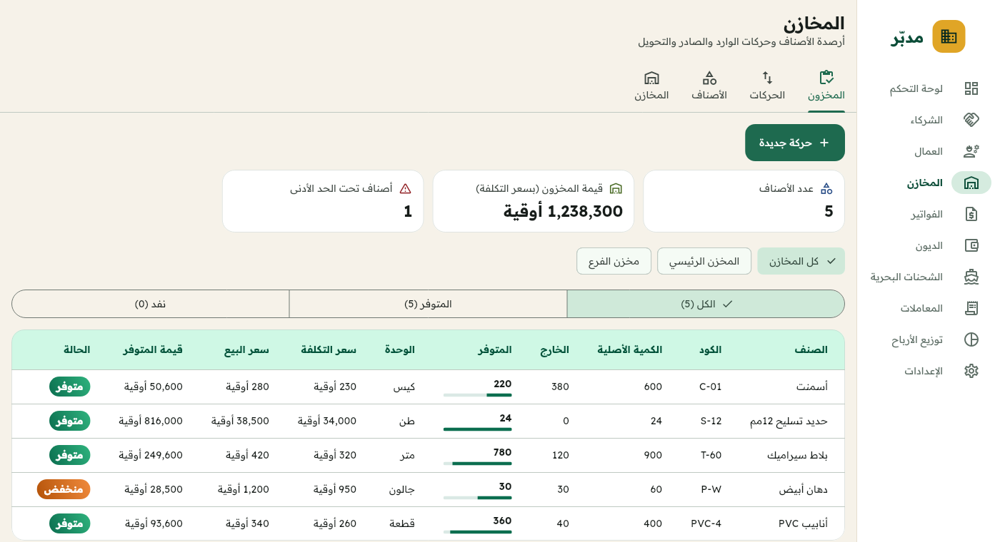
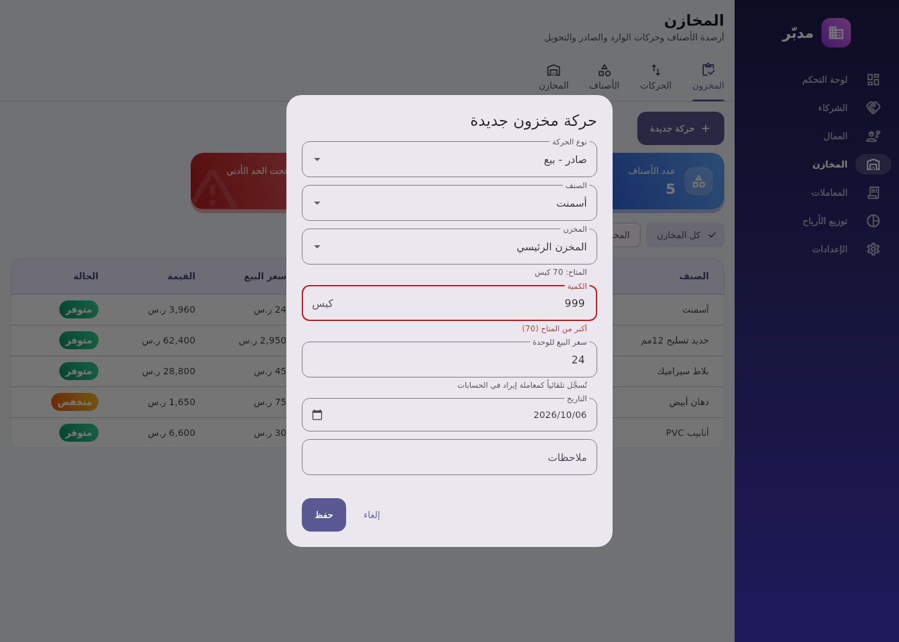
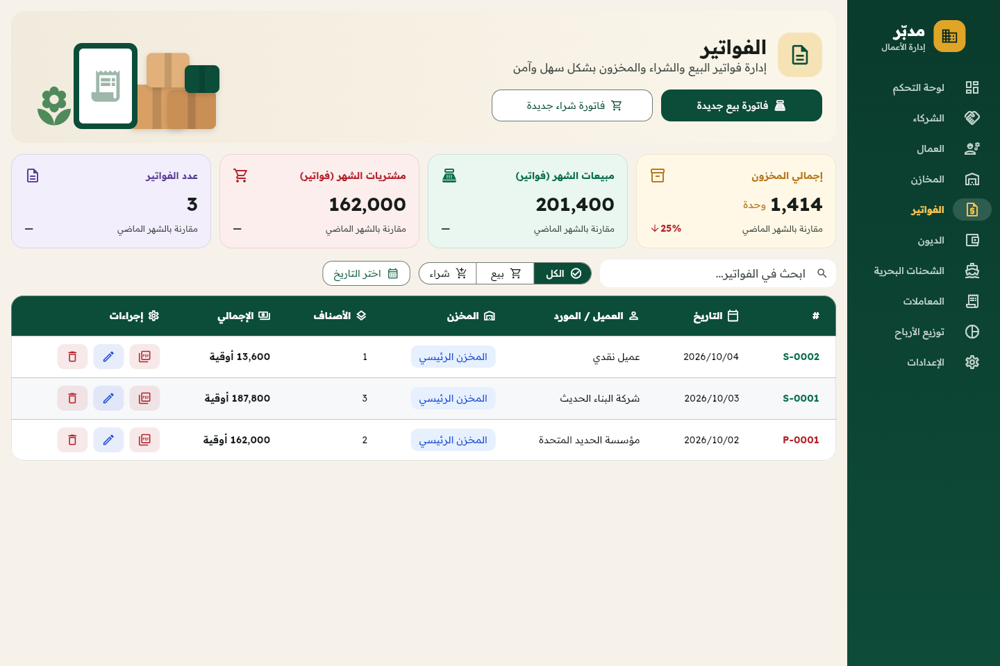
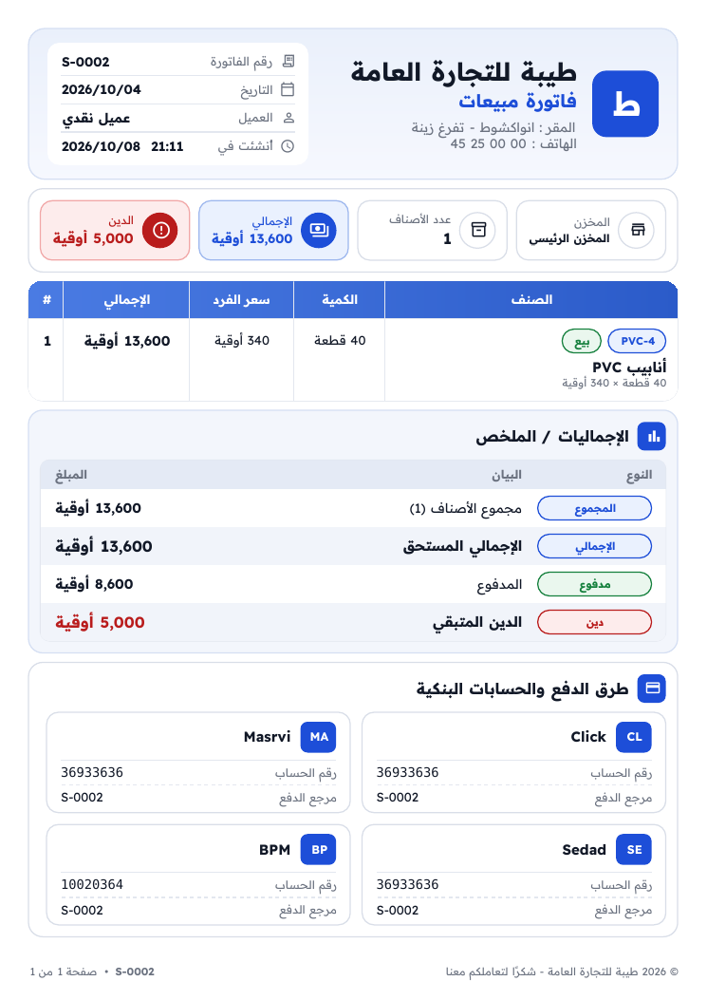

# مدبّر — لوحة تحكم لإدارة الأعمال والشركاء

تطبيق Flutter (Dart) بواجهة عربية (من اليمين لليسار) لإدارة أعمال شركة فيها **شركاء** و**عمال** و**مخازن** و**فواتير** قابلة للتصدير PDF.
يعمل على الويب وويندوز وماك ولينكس وأندرويد وiOS بنفس الكود.

## لقطات الشاشة



| المخازن | حركة مخزون |
|---|---|
|  |  |

| الفواتير | فاتورة PDF |
|---|---|
|  |  |

## المزايا

| القسم | ما يقدمه |
|---|---|
| **لوحة التحكم** | أربعة مؤشرات (إيرادات ومصروفات وصافي ربح الشهر، الرصيد النقدي)، مخطط آخر 6 أشهر، توزيع أرباح الشهر، تنبيه نقص المخزون، آخر المعاملات |
| **الشركاء** | إضافة/تعديل/حذف، نسبة الشراكة (مع منع تجاوز 100%)، رأس المال، الأرباح المستحقة والمسحوب والرصيد |
| **العمال** | الوظيفة والراتب والحالة، وزر **صرف راتب الشهر** الذي يسجّل المصروف تلقائياً |
| **المخازن** | عدة مخازن، أصناف بأسعار تكلفة وبيع وحد أدنى، حركات (شراء، بيع، إضافة، صرف/تالف، تحويل بين المخازن)، رصيد كل صنف في كل مخزن، قيمة المخزون، وتنبيه عند النقص |
| **الفواتير** | رأس فيه زرّا فاتورة بيع/شراء جديدة، وأربع بطاقات (إجمالي المخزون، مبيعات ومشتريات الشهر، عدد الفواتير) مع نسبة التغيّر عن الشهر الماضي، وبحث وتصفية بالنوع والفترة، وجدول برأس أخضر وأزرار PDF/تعديل/حذف. عميل/مورد، خصم (بدون ضريبة)، ترقيم تلقائي (S-0001 / P-0001)، ومعاينة وطباعة وتنزيل **PDF** |
| **الديون** | ديون **لنا** (زبائن بالآجل) وديون **علينا** (موردون)، تسجيل التسديدات على دفعات، المتبقي، تاريخ الاستحقاق وتنبيه الديون المتأخرة |
| **الشحنات البحرية** | الحاويات الواردة عبر شركات الشحن: البوليصة، رقم الحاوية، البضاعة، الموانئ، الإبحار والوصول المتوقع، المراحل (في البحر ← الميناء ← الجمارك ← الاستلام)، التكاليف، وبطاقة لكل شركة شحن |
| **المعاملات** | إيرادات ومصروفات بتصنيفات (مبيعات، رواتب، إيجار، مشتريات، مسحوبات…) مع فلترة حسب النوع والشهر |
| **توزيع الأرباح** | تقرير لهذا الشهر / هذه السنة / كل الفترات |
| **الإعدادات** | بيانات المنشأة (الاسم، الهاتف، العنوان، حسابات الدفع)، تحميل بيانات تجريبية، أو حذف كل البيانات |

## طريقة حساب الأرباح

1. **صافي الربح** = الإيرادات − المصروفات التشغيلية. المسحوبات لا تُحسب مصروفاً لأنها توزيع أرباح.
2. يُوزَّع صافي الربح (أو الخسارة) **على الشركاء حسب نسبهم**.
3. **رصيد** كل شريك = حصته من الربح − ما سحبه في نفس الفترة.

## كيف يعمل المخزون

- تبويب **المخزون** يعرض لكل صنف **الكمية الأصلية** (كل ما دخل المخزن: شراء، إضافة، تحويل وارد)، و**الخارج**، و**المتوفر** مع شريط نسبته من الأصلية، وتصفية **الكل / المتوفر / نفد**. عند عرض كل المخازن معاً لا يُحسب التحويل بينها.
- الرصيد لا يُكتب يدوياً، بل يُحسب من الحركات. هذا يحفظ سجلاً كاملاً لكل كمية دخلت أو خرجت.
- **الشراء** يُسجَّل تلقائياً كمصروف "مشتريات"، و**البيع** يُسجَّل تلقائياً كإيراد "مبيعات". تعديل الحركة أو حذفها يعدّل المعاملة المالية معها،
  ولذلك لا تُعدَّل هذه المعاملات من شاشة المعاملات.
- **الإضافة** (رصيد افتتاحي، مرتجع) و**الصرف/التالف** و**التحويل** تغيّر الكميات فقط بدون أثر مالي.
- لا يمكن صرف أو تحويل كمية أكبر من المتاح في المخزن.
- لا يمكن حذف مخزن أو صنف عليه حركات.

## الديون

- كل دين له طرف (مدين أو دائن) ومبلغ وتاريخ، وتاريخ استحقاق اختياري.
- زر **تسجيل تسديد** يضيف دفعة؛ لا يُقبل تسديد أكبر من المتبقي، ولا تخفيض مبلغ الدين تحت ما سُدِّد.
- الحالة تُحسب تلقائياً: غير مسدَّد، مسدَّد جزئياً، متأخر (بعد تاريخ الاستحقاق)، مسدَّد.
- الديون سجل متابعة مستقل ولا تُضاف إلى الإيرادات أو المصروفات تلقائياً.

## الشحنات البحرية

- كل شحنة تتبع شركة شحن، وتظهر بطاقة لكل شركة بعدد شحناتها الجارية وتكلفتها؛ الضغط على البطاقة يعرض شحنات تلك الشركة فقط.
- عند إضافة شحنة تظهر أسماء الشركات السابقة للاختيار السريع.
- زر **تغيير الحالة** في الجدول ينقل الشحنة بين المراحل، وعند **تم الاستلام** يُسجَّل تاريخ الاستلام.
- الشحنة **متأخرة** إذا بقيت في البحر بعد تاريخ الوصول المتوقع. لوحة التحكم تنبّه للشحنات المتأخرة أو التي تصل خلال أسبوع.
- التكلفة = قيمة البضاعة + الشحن + الجمارك والتخليص. الشحنات سجل متابعة ولا تُضاف إلى المصروفات أو المخزون تلقائياً.

## الفواتير و PDF

- **فاتورة البيع** تُنقص المخزون من المخزن المختار وتُسجَّل إيراد "مبيعات" بإجمالي الفاتورة.
  **فاتورة الشراء** تزيد المخزون وتُسجَّل مصروف "مشتريات".
- **لا ضريبة في النظام**: الإجمالي = المجموع − الخصم، وهو المبلغ المسجَّل في الحسابات. الفواتير المحفوظة سابقاً بضريبة تُقرأ بدونها ويُحدَّث مبلغ معاملتها ودينها تلقائياً.
- لا تُحفظ فاتورة بيع بكمية أكبر من المتاح. تعديل الفاتورة يستبدل حركاتها ومعاملتها، وحذفها يلغيهما.
  لا تُحذف فاتورة شراء إذا كانت كمياتها قد بيعت أو صُرفت.
- حركات الفواتير ومعاملاتها لا تُعدَّل من شاشتي المخازن والمعاملات، بل من الفاتورة نفسها.
- **صور الأصناف:** في الفاتورة تظهر صورة كل صنف بجانب سطره، والضغط عليها يرفع صورة أو يغيّرها قبل حفظ الفاتورة
  (ويمكن ذلك أيضاً من تبويب **الأصناف**). تُصغَّر الصورة تلقائياً إلى 480 بكسل بصيغة JPEG وتُحفظ مع الصنف،
  وتظهر في جدول فاتورة PDF.
- معاينة PDF على الويب تستخدم مكتبة **pdf.js** المضمَّنة في `web/pdfjs` (نسخة legacy تعمل على المتصفحات الأقدم، رخصة Apache 2.0) بدل تحميلها من الإنترنت.
- **تصميم الفاتورة**: رأس أزرق فاتح فيه شعار المؤسسة واسمها ونوع الفاتورة والمقر، وبجانبه مربع بيانات الفاتورة بأيقونات (الرقم، التاريخ، العميل، الهاتف، وقت الإنشاء). تحته أربعة مربعات: المخزن، عدد الأصناف، الإجمالي (أزرق)، والدين (أخضر إذا 0، أحمر إذا يوجد). ثم جدول أصناف برأس أزرق، وجدول «الإجماليات / الملخص»، وبطاقات حسابات الدفع. الأيقونات من خط Material Icons (جزء صغير في `assets/fonts/InvoiceIcons.ttf`، رخصة Apache 2.0).
- **الدين في الفاتورة**: قبل الحفظ تختار «مدفوعة كاملة» أو «دين» وتكتب المدفوع الآن. الباقي يُسجَّل ديناً مرتبطاً بالفاتورة في شاشة **الديون** (لنا على العميل في البيع، وعلينا للمورد في الشراء). تعديل الفاتورة يعدّل الدين ويُبقي تسديداته، وحذفها يحذفه. فاتورة PDF تعرض **المدفوع** و**الدين المتبقي** بعد التسديدات (0 إذا لا يوجد دين).
- **لغة الفاتورة**: في صفحة PDF أزرار «العربية / Français / English». الفرنسية والإنجليزية من اليسار لليمين وبعملة MRU، وتبقى بيانات المستخدم (الأسماء والأصناف والوحدات) كما كُتبت. اسم الملف يحمل رمز اللغة (مثل S-0001-fr.pdf). النصوص في `lib/pdf/invoice_strings.dart`.
- **حسابات الدفع** (Click وMasrvi وSedad: 36933636، وBPM: 10020364) تظهر في مربع «طرق الدفع» أسفل كل فاتورة بيع. تُعدَّل أو تُحذف أو يُضاف غيرها من **الإعدادات ← بيانات المنشأة**.
- زر **PDF** يفتح معاينة الفاتورة، ومنها **طباعة** أو **تنزيل PDF**. على الويب يُنزَّل الملف مباشرة،
  وعلى الجوال تفتح قائمة المشاركة (واتساب، بريد، حفظ في الملفات…).
- التطبيق وملف PDF يستخدمان خط **Readex Pro** (عربي ولاتيني بأسلوب Lexend، مثل تقرير GROUPE ATLANTIC المرجعي) المضمَّن (`assets/fonts`، رخصة OFL)، فيعملان بالعربية بدون إنترنت. أُضيفت لملفي الخط أشكال الحروف العربية المتصلة (Presentation Forms) من جداول الخط نفسه لأن مكتبة PDF تحتاجها، ولكل رمز حرف شكل مستقل (بلا أشكال مشتركة أو مركّبة) لأن مكتبة PDF تخلط بين الأشكال المشتركة.

## قاعدة البيانات (Supabase)

التطبيق يحفظ البيانات في Supabase حتى تظهر نفسها على كل الأجهزة، ويطلب تسجيل الدخول.
كل حفظ يُكتب أولاً على الجهاز ثم يُرفع؛ عند انقطاع الإنترنت تبقى التغييرات على الجهاز
وتُرفع تلقائياً عند عودة الاتصال (أيقونة السحابة في الشريط العلوي تبيّن الحالة).

الدخول باسم مستخدم وكلمة مرور فقط (بدون بريد إلكتروني ولا Supabase Auth). الإعداد
مرة واحدة: في Supabase افتح **SQL Editor ← New query**، الصق محتوى
[`supabase/schema.sql`](supabase/schema.sql) واضغط **Run**. ينشئ الجداول ودوال التحقق
وحساب الدخول `36933636`. لتغيير كلمة المرور أو إضافة مستخدم عدّل آخر سطر فيه وشغّله.

عند أول دخول، إذا كانت قاعدة البيانات فارغة تُرفع إليها البيانات الموجودة على ذلك الجهاز.

الرابط والمفتاح العام في `lib/data/cloud.dart`، ويمكن تغييرهما عند البناء:
`--dart-define=SUPABASE_URL=... --dart-define=SUPABASE_KEY=...`
(القيمة الفارغة تعيد الحفظ على الجهاز فقط). المفتاح العام (publishable) آمن داخل التطبيق؛
لا تضع أبداً المفتاح السري (`sb_secret_...` / `service_role`) في التطبيق.

## التشغيل

```bash
flutter pub get
flutter run -d chrome      # ويب
flutter run -d windows     # ويندوز (أو macos / linux)
flutter test               # الاختبارات
```

## الموقع على GitHub Pages

يُنشر الموقع تلقائياً بعد نجاح الاختبارات على:
**https://ahmedtalb872.github.io/Medaba/**

لا يحتاج أي إعداد. إذا لم يعمل الرابط بعد أول نشر: **Settings ← Pages ← Source: Deploy from a branch ← gh-pages / (root) ← Save**.

## الموقع على Vercel

يُبنى الموقع ويُرفع إلى Vercel تلقائياً من GitHub Actions بعد نجاح الاختبارات:
- التحديث على فرع **main** يُنشر على الرابط الأساسي (Production).
- أي فرع أو Pull Request آخر يُنشر على **رابط معاينة** منفصل.
- الرابط يظهر في صفحة التشغيل في تبويب **Actions** (ملخص المهمة **Deploy web to Vercel**).

**الإعداد لمرة واحدة:**
1. في Vercel: **Account Settings ← Tokens ← Create Token**، وانسخ المفتاح.
2. في GitHub: **Settings ← Secrets and variables ← Actions ← New repository secret**،
   الاسم `VERCEL_TOKEN` والقيمة هي المفتاح.
3. أعد تشغيل آخر **Build** من تبويب **Actions** (Re-run all jobs) أو ادفع أي تحديث.

يُنشأ مشروع باسم `medaba` في حسابك تلقائياً. إعدادات اختيارية (Variables بجانب Secrets):
- `DEMO_DATA`: `true` (الافتراضي) ليبدأ الموقع ببيانات تجريبية، أو `false` لنسخة فارغة للاستخدام الفعلي.
- `VERCEL_SCOPE`: اسم الفريق إذا كان المشروع ضمن فريق في Vercel وليس الحساب الشخصي.

## تطبيق ماك (macOS)

يُبنى تطبيق ماك تلقائياً على GitHub Actions (`.github/workflows/build.yml`) مع كل تحديث، بعد نجاح الفحص والاختبارات.

**التنزيل:**
1. افتح تبويب **Actions** في المستودع، ثم آخر تشغيل ناجح لـ **Build**.
2. من أسفل الصفحة نزّل **Medaba-macOS** (ملف zip بداخله `Medaba.dmg`).
3. افتح `Medaba.dmg` واسحب **Medaba** إلى مجلد **Applications**.

عند إنشاء وسم إصدار مثل `v1.0.0` يُرفق `Medaba.dmg` تلقائياً بصفحة **Releases**.

**أول تشغيل:** التطبيق غير موقَّع بشهادة مطوّر من Apple، لذلك يمنعه macOS في المرة الأولى.
اضغط على التطبيق بالزر الأيمن ← **فتح (Open)** ← **فتح** مرة أخرى. إذا لم يظهر خيار الفتح:
**إعدادات النظام ← الخصوصية والأمان ← افتح على أي حال (Open Anyway)**.
لإزالة هذه الخطوة نهائياً يلزم حساب Apple Developer لتوقيع التطبيق وتوثيقه (Notarization).

## هيكل المشروع

```
lib/
  main.dart                 نقطة البداية، الثيم، اللغة العربية
  models/models.dart        الشريك، العامل، المعاملة
  models/inventory.dart     المخزن، الصنف، حركة المخزون
  models/invoice.dart       الفاتورة، سطر الفاتورة، بيانات المنشأة
  models/debt.dart          الدين والتسديدات
  models/shipment.dart      الشحنة البحرية ومراحلها
  pdf/invoice_pdf.dart      تصميم الفاتورة PDF
  data/storage.dart         التخزين (SharedPreferences حالياً)
  state/app_state.dart      إدارة الحالة + حسابات الأرباح
  screens/                  الشاشات
  widgets/                  مكونات مشتركة (بطاقات، جداول، نماذج، مخطط)
  utils/format.dart         تنسيق العملة والتواريخ والأرقام
```

## ملاحظات وخطوات مقترحة لاحقاً

- **التخزين محلي** على الجهاز حالياً، أي أن كل جهاز له بياناته. لمشاركة البيانات بين الشركاء على أكثر من جهاز
  يمكن استبدال `PrefsStorage` بتطبيق لـ `Storage` يعتمد على Firebase/Supabase أو خادم خاص، دون تغيير الشاشات.
- العملة **الأوقية الموريتانية** (`currencySymbol` في `lib/utils/format.dart`)، والبيانات التجريبية بعناوين في نواكشوط. اسم المؤسسة الافتراضي **طيبة للتجارة العامة** والمقر **انواكشوط - تفرغ زينة** (يُغيَّران من الإعدادات).
- الألوان مستوحاة من علم موريتانيا (أخضر، ذهبي، أحمر على خلفية رملية) وكلها في `lib/theme/app_colors.dart`؛ لتغيير الهوية يكفي تعديل هذا الملف.
- أفكار لاحقة: تسجيل دخول وصلاحيات (شريك يرى حصته فقط)، تصدير التقارير إلى Excel، سجل حضور العمال، سلف العمال، فواتير بيع وشراء بعدة أصناف، الموردون والعملاء، جرد دوري.
